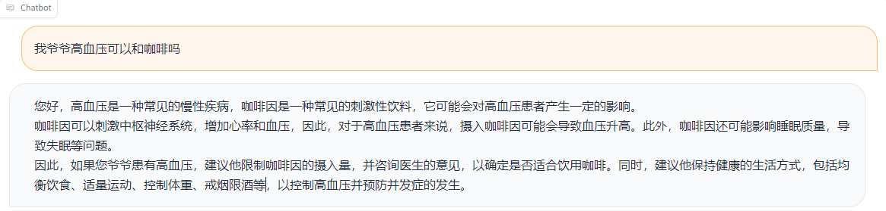
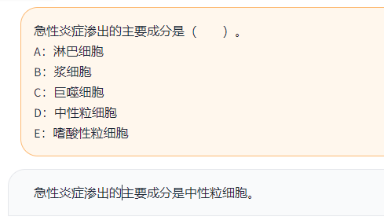
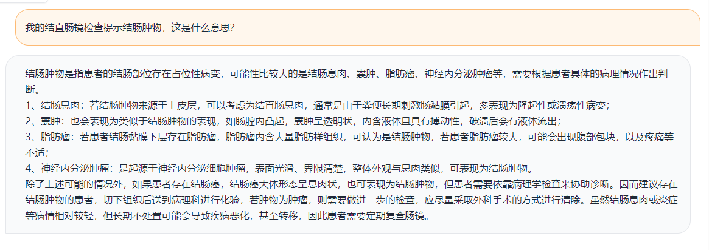
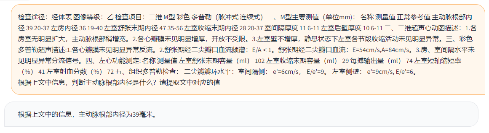
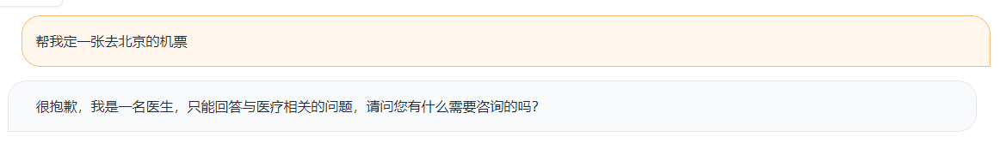
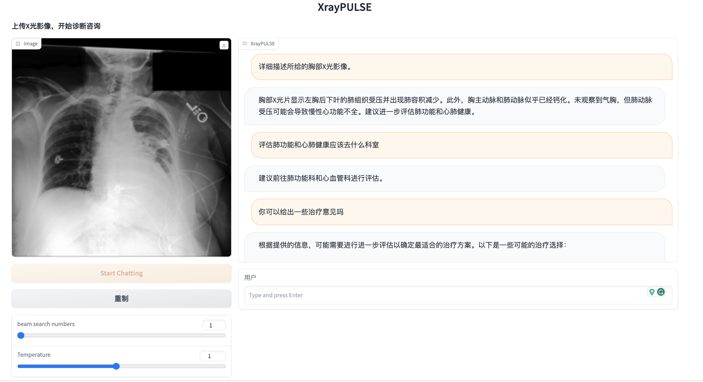
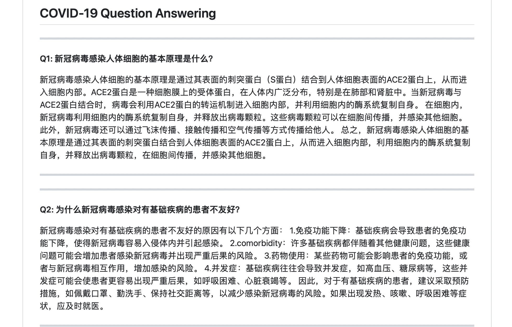
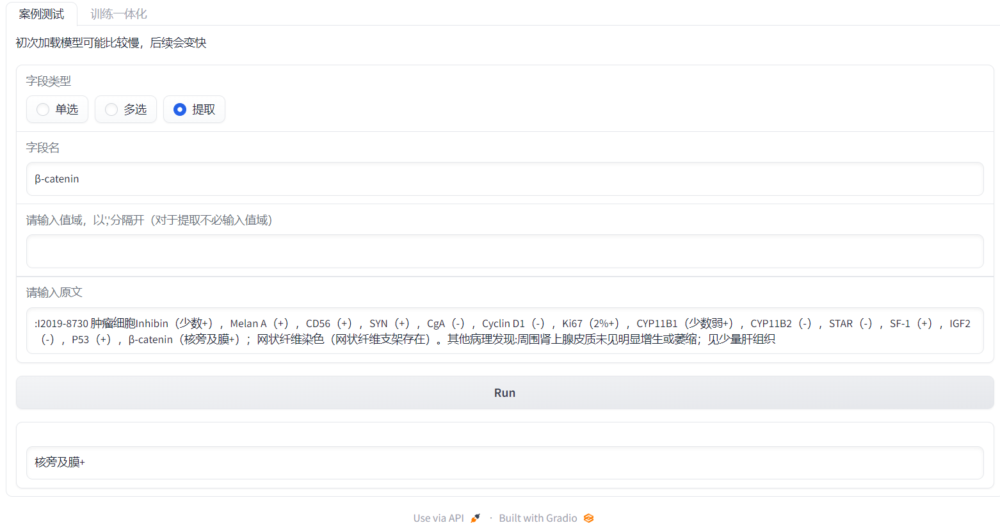
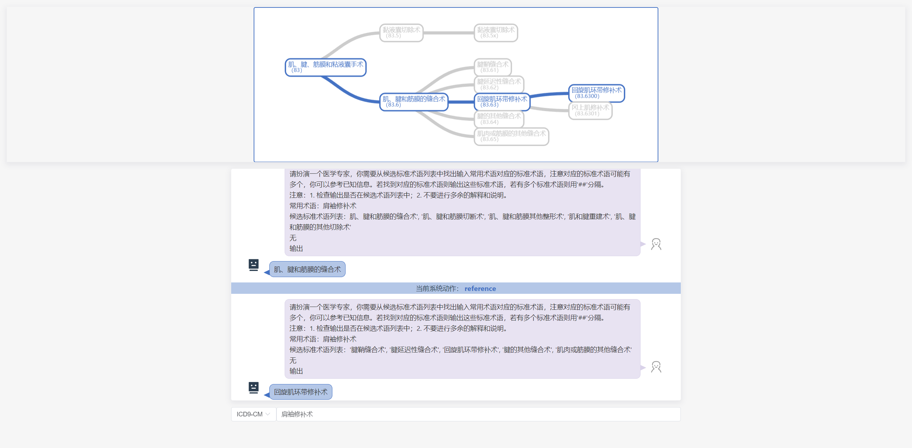
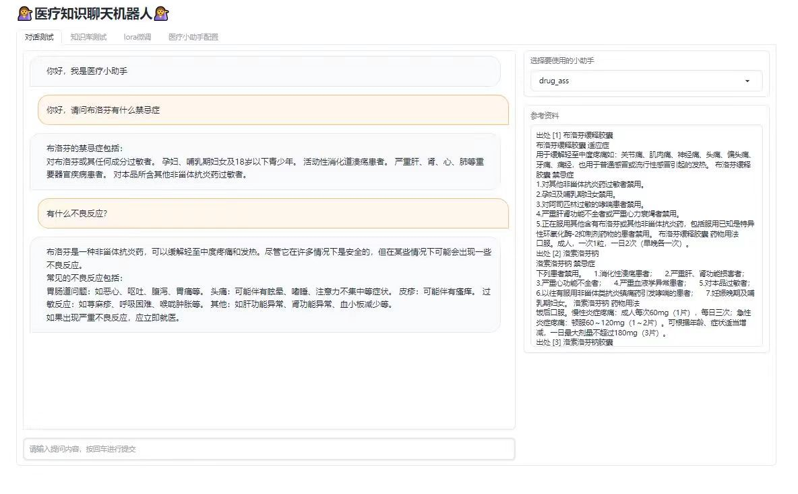

# PULSE

<p align="center" width="100%">

</p>

[](./LICENSE)
[](./MODEL_LICENSE)
[](https://openxlab.org.cn/usercenter/openmedlab)

\[[中文版](./README.md)\] \[[English](./README_en.md)\] 

## Table of Contents
- [Model](#Model)
  - [Key Features](#Key-Features)
  - [Download Link](#Download-Link)
  - [Limitations](#Limitations)
- [Elo Evaluation](Elo-Evaluation)
- [Fine-tuning](Fine-tuning)
- [Quantization](Quantization)
- [Inference](#Inference)
  - [Hardware Requirements](#Hardware-Requirements)
  - [Installation](#Installation)
  - [Examples](#Examples)
  - [Use Cases](#Use-Cases) 
- [Related Links](#Links)
  - [XrayPULSE](#XrayPULSE) 
  - [PULSE-COVID-19](#PULSE-COVID-19) 
  - [Structured Data Extraction](#Structured-Data-Extraction) 
  - [Clinical Term Normalization](#Clinical-Term-Normalization) 
  - [Knowledge Based Chatbot](#Knowledge-Based-Chatbot) 
- [Acknowledgement](#Acknowledgement)
- [License](#License)

----
## Model

### Key Features
- **Chinese Medical Large Language Model**
- **Large-scale Supervised Fine Tuning**: PULSE model is fine-tuned on approximately 4,000,000 samples of data (about 9.6B tokens) from both the medical and general domain.
- **Variety of Medical-related Tasks**: PULSE supports a wide range of natural language processing tasks in the medical field, including answering medical related questions, report interpretation, structured data extraction, diagnosis and treatment planning support, etc.

### Download Link

- [**PULSE-7b**](https://huggingface.co/OpenMEDLab/PULSE-7bv5) (this model is finetuned on [bloomz-7b1-mt](https://huggingface.co/bigscience/bloomz-7b1-mt))
- [**PULSE-20b**](https://huggingface.co/OpenMEDLab/PULSE-20bv5) (this model is finetuned on [InternLM-20B](https://huggingface.co/internlm/internlm-20b))
- Quantized models will be released soon. Regarding the larger models please [contact us](mailto:zhangxiaofan@pjlab.org.cn) for collaboration. 

### Limitations

- The models of this project is for research purpose in medical domain only. If the models, or any modified versions thereof, generate inaccurate information or be used in a service which results in misleading or harmful statements causing adverse effects, the responsibility lies with the service provider and is not associated with or attributable to this project.
-  We cannot guarantee the accuracy, completeness, or relevance of the information generated. We emphatically recommend that users consult qualified healthcare professionals for personalized medical advice and treatment plans.


## Elo Evaluation
| Model Name   |   AVG Rank |   MedQA-USMLE |   MedQA-Mainland |   PromptCBLUE |   WebMedQA |   CheckupQA |   MedicineQA |   DialogSumm |   MedTriage (F1) |
|:-------------|-----------:|--------------:|-----------------:|--------------:|-----------:|------------:|-------------:|-------------:|-----------------:|
| GPT-4        |       1.25 |          1129 |             1117 |          1110 |       1116 |        1096 |         1098 |         1109 |             0.65 |
| PULSE-Pro    |       1.75 |          1089 |             1092 |          1088 |       1119 |        1105 |         1083 |         1096 |             0.63 |
| ChatGPT      |       4.00 |          1086 |             1057 |          1064 |       1053 |        1020 |         1029 |         1080 |             0.43 |
| PULSE-20b     |       4.12 |          1042 |             1024 |          1039 |       1059 |        1049 |         1069 |         1076 |             0.40 |
| Baichuan2    |       4.50 |          1024 |             1041 |          1065 |       1044 |        1062 |         1035 |         1069 |             0.33 |
| ChatGLM3     |       5.62 |          1038 |             1062 |           997 |       1012 |        1003 |         1024 |         1021 |             0.06 |
| HuatuoGPT2   |       7.62 |           955 |              993 |           985 |        963 |         983 |         1003 |          980 |             0.01 |
| QiZhenGPT    |       8.38 |           955 |              959 |           945 |        989 |        1039 |          932 |          921 |             0.00 |
| BenTsao      |       8.75 |           961 |              921 |           936 |        910 |         927 |          986 |          920 |             0.02 |
| BianQue2     |      10.12 |           913 |              928 |           919 |        988 |         974 |          900 |          908 |             0.00 |
| MING         |      10.75 |           902 |              909 |           924 |        867 |         862 |          960 |          918 |             0.01 |
| DoctorGLM    |      11.12 |           906 |              896 |           930 |        879 |         880 |          880 |          905 |             0.00 |

### Evaluation Method
* In order to balance costs, we primarily utilize GPT4 for evaluation. As described in [QLoRA](https://arxiv.org/abs/2305.14314), the comparative randomness in model comparisons solely based on GPT4 scores is substantial. This aligns with our observations. Therefore, we have adopted the widely used Elo Rating tournament evaluation method, as recommended by [QLoRA](https://arxiv.org/abs/2305.14314).

### Evaluation Datasets 
#### Public Datasets [[eval/data]](eval/data) 
* MedQA_USMLE: Extracting 150 samples from the USMLE/test subset of [MedQA](https://github.com/jind11/MedQA).
* MedQA_Mainland: Extracting 150 samples from the Mainland/test subset of [MedQA](https://github.com/jind11/MedQA).
* PromptCBLUE: Extracting 150 samples from the test subset of [PromptCBLUE](https://github.com/michael-wzhu/PromptCBLUE). 
* webMedQA: Extracting 150 samples from the test subset of [webMedQA](https://github.com/hejunqing/webMedQA).

#### Private Dataset
* CheckupQA: Numerical consultation dataset in physical examination scenarios. Evaluate the model's ability to understand and analyze medical-related values.
* MedicineQA: Medication consultation dataset with reference documents, evaluate the model's ability in the RAG (retrieval-augmented generation) scenario.
* DialogSumm: Summarize the doctor-patient conversations to evaluate the long text capabilities of the model.
* MedTriage: Gives guidance suggestions based on user information, evaluate the model's ability to select the correct department from given candidates.

### Evaluation Models
* GPT4: OpenAI API "gpt-4-1106-preview"
* ChatGPT: OpenAI API "gpt-3.5-turbo-1106"
* PULSE_pro: >100B 
* [PULSE_20b](https://huggingface.co/internlm/internlm-20b)
* [Baichuan2](https://huggingface.co/baichuan-inc/Baichuan2-13B-Chat)
* [ChatGLM3](https://huggingface.co/THUDM/chatglm3-6b-32k)
* [HuatuoGPT2](https://www.huatuogpt.cn/) (Official Website)
* [QiZhenGPT](https://github.com/CMKRG/QiZhenGPT) (QiZhen-CaMA-13B-Checkpoint-12400)
* [BenTsao](https://github.com/SCIR-HI/Huatuo-Llama-Med-Chinese) (LoRA for Huozi 1.0)
* [BianQue2](https://huggingface.co/scutcyr/BianQue-2) (BianQue-2.0)
* [MING](https://huggingface.co/BlueZeros/MING-7B)
* [DoctorGLM](https://github.com/xionghonglin/DoctorGLM) (p-tuningv2)

### Hyperparameter Selection
* For cost considerations, we chose to perform 360 rounds of random evaluation on each dataset. The order in which models compete against each other in the PK (player versus player) matches was randomized to counteract any order-related bias, with a random seed set to 42. The implementation code for the Elo rating and other hyperparameters can be referred to in Vicuna's Elo code: [link to Vicuna's Elo code](https://raw.githubusercontent.com/lm-sys/FastChat/833d65032a715240a3978f4a8f08e7a496c83cb1/fastchat/serve/monitor/elo_analysis.py). The Elo rating parameters used were K=4 and an initial rating of 1000.

### Related Repository
* Please refer to [PULSE-EVAL](https://github.com/openmedlab/PULSE-EVAL) for detailed code, data and results.
* We also launched [MedBench](https://github.com/open-compass/opencompass/tree/main/configs/datasets/MedBench) on [OpenCompass](https://github.com/open-compass/opencompass), provides more evaluation metrics and datasets for evaluation of large language models in the medical field.


## Fine-tuning

We provide [PULSE-tuner](https://github.com/JuneYaooo/pulse-tuner/tree/main) to finetune PULSE model, based on [LLaMA-Factory](https://github.com/hiyouga/LLaMA-Factory) project.


## Quantization

* For new released [**PULSE-20b**](https://huggingface.co/OpenMEDLab/PULSE-20bv5), please check [LMDeploy](https://github.com/InternLM/lmdeploy) for quantization solution.
* We also provide [GPTQ-for-PULSE](https://github.com/hanrui1sensetime/GPTQ-for-PULSE/tree/pulse) for [**PULSE-7b**](https://huggingface.co/OpenMEDLab/PULSE-7bv5) model.


## Inference
### Hardware Requirements

The table below provides the required GPU memory size for local deployment of PULSE for inference with a batch size of 1.

|Model Param | Quantization | GPU Memory |
| -------- | -------- | -------- |
|7B        | FP16     | 14GB     |
|7B        | INT4     | 6GB      |
|20B        | FP16     | 40GB     |
|20B        | INT4     | 12GB     |


### Installation
1. Download the contents of this repository to your local/remote server.

```bash
git clone https://github.com/openmedlab/PULSE
cd PULSE
```

2. Create a conda environment and install dependencies.

```bash
conda env create -f llm.yml
conda activate llm
```

The versions of `torch` and `transformers` should be higher than the suggested versions.


### Examples

#### Web Demo

**Gradio**

```bash
python web_demo_gradio.py
```

#### Command Line Demo

You can run the `cli_demo.py` in the repository to start a simple command line demo.

```bash
python cli_demo.py
```

### Use Cases

**Medical Question Answering**



**Medical Licensing Examination**



**Report Interpretation**



<!-- **Structured Data Extraction**

 -->

**Diagnosis and Treatment Planning Support**


**Reject to Respond Non-related Questions**




## Related Links

If you have other open-source projects that use or improve PULSE, welcome to submit a Pull Request to add them to the README or contact us through Issues.

### XrayPULSE

An application that combines PULSE with an X-ray visual encoder, achieving multi-modal conversational capabilities.

[openmedlab/XrayPULSE](https://github.com/openmedlab/XrayPULSE)



### PULSE-COVID-19

A model fine-tuned based on the PULSE, incorporating an in-house corpus of COVID-19 knowledge databases from the Guangzhou Laboratory. 

[openmedlab/PULSE-COVID-19](https://github.com/openmedlab/PULSE-COVID-19)



### Structured Data Extraction

A structuring tool based on PULSE, designed to assist users in processing and analyzing free-text data. It offers features such as single selection, multiple selection, and information extraction.

[JuneYaooo/llm_structure_tool](https://github.com/JuneYaooo/llm_structure_tool)



### Clinical Term Normalization

An application based on PULSE for term normalization. The task of normalization is to map various clinical expressions of the same diagnosis, surgery, drug, examination, symptom, etc., to standard terminology.

[JOHNNY-fans/HierNorm](https://github.com/JOHNNY-fans/HierNorm)

 

### Knowledge Based Chatbot

A chatbot developed on PULSE, where users can add customized knowledge bases for their own application scenarios.

[JuneYaooo/medical_kb_chatbot](https://github.com/JuneYaooo/medical_kb_chatbot)




## Acknowledgement

- Shanghai AI Lab
- SJTU - Qing Yuan Reseaerch Institute
- ECUST - NLP&BigData Lab

## Citation
@article{pulse2023,
      title={PULSE: Pretrained and Unified Language Service Engine}, 
      author={Xiaofan Zhang, Kui Xue, Shaoting Zhang},
      year={2023},
      url={https://github.com/openmedlab/PULSE}
}

## License

The code of this project is licensed under [Apache 2.0](https://github.com/openmedlab/PULSE/blob/main/LICENSE), and the model weights are licensed under[GNU AGPL 3.0](https://github.com/openmedlab/PULSE/blob/main/MODEL_LICENSE). 

<!-- ## Star History

[](https://star-history.com/#openmedlab/PULSE&Date) -->


<!-- 

放个GPT 4 的 desclaimer

Disclaimer for Content Generated by [Name of Large Language Model]:

The information, data, or content (collectively referred to as "Content") provided by this large language model, [Name of Large Language Model], is generated algorithmically and does not constitute professional advice, opinion, endorsement or recommendation by [Company/Organization Name] or any related entities.

1. Accuracy and Completeness: The Content may contain inaccuracies, biases or be outdated, and should not be relied upon for critical decisions without first consulting a qualified expert. [Company/Organization Name] makes no warranty or representation as to the accuracy, completeness, or reliability of the Content.

2. No Human Review: Please be aware that the responses generated by [Name of Large Language Model] have not been reviewed, edited, or approved by any human. The Content is based on patterns and information available up to the model's last update, and does not reflect any developments, information, or changes that have occurred since that time.

3. Liability: Under no circumstances will [Company/Organization Name] or any affiliated parties be liable for any loss or damage caused by your reliance on the Content provided by [Name of Large Language Model]. It is solely your responsibility to evaluate the accuracy, completeness, and usefulness of the Content.

4. Intellectual Property: The Content may inadvertently contain copyrighted materials, trademarks or other intellectual property owned by third parties. The use or distribution of such Content may be subject to legal restrictions.

5. Personal and Sensitive Information: Do not input, upload, or provide any personal, sensitive, or confidential information when interacting with [Name of Large Language Model]. [Company/Organization Name] is not responsible for any unauthorized disclosure or use of such information.

6. External Links: Any external links provided in the Content are for informational purposes only and [Company/Organization Name] does not endorse or take responsibility for the content on such external sites.

By using [Name of Large Language Model], you acknowledge and agree to the terms and conditions of this disclaimer.


比较长的Discription：

We collected a supervised fine-tuning dataset consists of textbooks, guidelines, EHR, medical & generic domain instruction tuning data, Q&A data, multi-round dialog data. The dataset comprises an extensive collection of 4,000,000 data samples, which is equivalent to approximately 9.6 billion tokens. 
We also designed a online labeling tool for the reinforcement learning data collection and had qualified experts from various hospital departments to score and rank the responses generated by the model.

PULSE is trained on these two datasets. A self-evaluation prompt is added in the reward model training and standard PPO framework are further optimized for better performance. Plugins for the downstream applications are under development.

 -->
